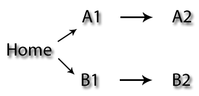

## Parallel Paths

### Motivation
In Android applications, it's sometimes necessary to allow users to perform two functions within the same app at the same time. 

To easily maintain the state of these functions and allow easy switching between them, we use the Task framework. More reading on Tasks is available on the developer site: [http://developer.android.com/guide/components/tasks-and-back-stack.html](http://developer.android.com/guide/components/tasks-and-back-stack.html)

### android-parallel-paths
The goal of this project is to provide a simple **reference implementation** of parallel tasks in Android, including navigation back to a "home" screen.

In the application, a Home activity offers two tasks, "A" and "B". The user can navigate from Activity A1 -> A2 and from B1 -> B2 and can switch from task "A" to "B" at any time, or go to the home screen directly.

Furthermore, when the user clicks the "back" button from the home screen, the app should exit and the user should be taken to the device home screen.

An overview of this navigation heirarchy is show in the diagram below:

### License

    Copyright 2013 Mike Kelley

    Licensed under the Apache License, Version 2.0 (the "License");
    you may not use this file except in compliance with the License.
    You may obtain a copy of the License at

       http://www.apache.org/licenses/LICENSE-2.0

    Unless required by applicable law or agreed to in writing, software
    distributed under the License is distributed on an "AS IS" BASIS,
    WITHOUT WARRANTIES OR CONDITIONS OF ANY KIND, either express or implied.
    See the License for the specific language governing permissions and
    limitations under the License.